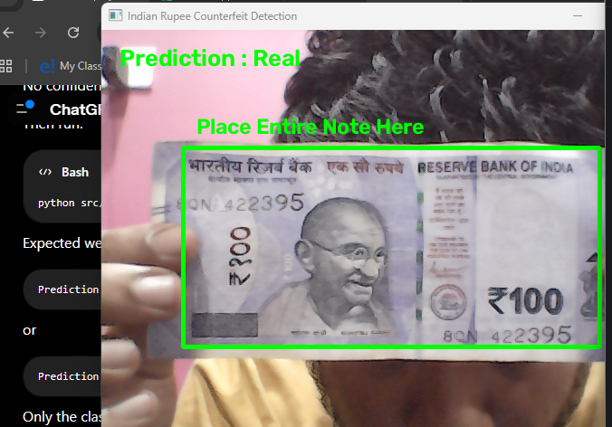
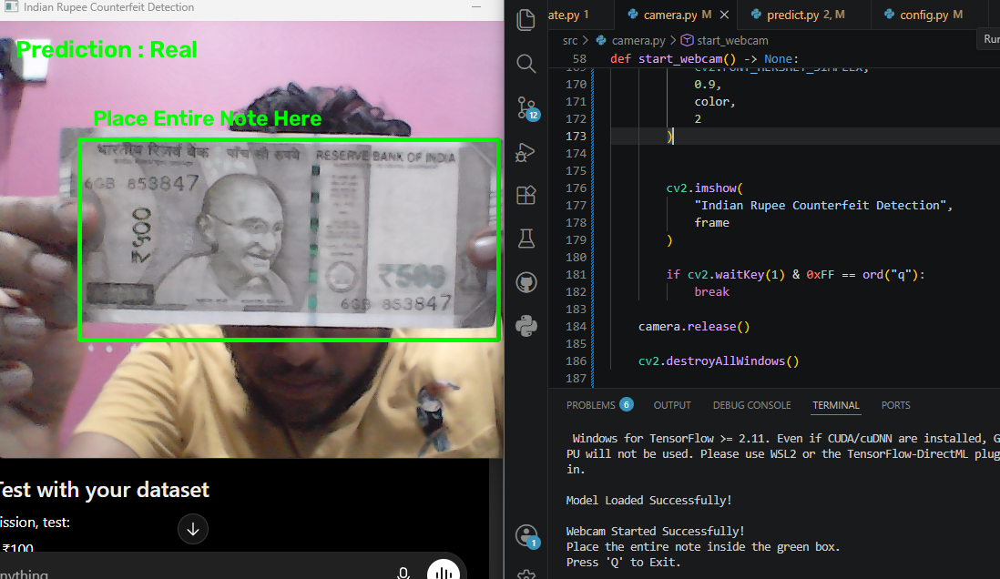
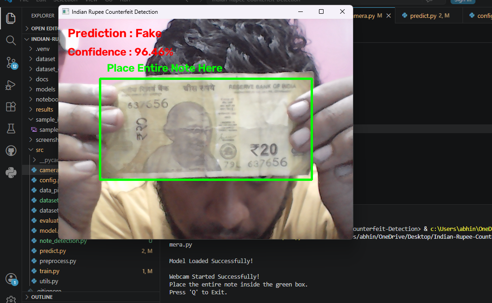

# Indian Rupee Counterfeit Detection System

## 📖 Overview

The **Indian Rupee Counterfeit Detection System** is a Machine Learning and Computer Vision project developed to classify Indian currency notes as **Real** or **Fake** using a Convolutional Neural Network (CNN).

The system currently supports **₹100** and **₹500** currency notes. It performs image preprocessing using OpenCV and classifies notes through both **image-based prediction** and **real-time webcam detection**. The project is built using TensorFlow/Keras and follows a modular structure for easy maintenance and future enhancements.

---

## ✨ Features

- Classification of ₹100 and ₹500 currency notes
- Image preprocessing using OpenCV
- Custom CNN model built with TensorFlow/Keras
- Image prediction from uploaded images
- Real-time webcam prediction
- Automatic Region of Interest (ROI) for note detection
- Configurable confidence threshold for binary classification
- Model evaluation using accuracy, confusion matrix, and classification report
- Clean and modular project structure

---

## 🛠 Technologies Used

- Python
- OpenCV
- TensorFlow / Keras
- NumPy
- Matplotlib
- Scikit-learn

---

## 📁 Project Structure

```text
Indian-Rupee-Counterfeit-Detection/
│
├── dataset/
│   ├── processed/
│   │   ├── train/
│   │   └── test/
│
├── docs/
├── models/
├── notebooks/
├── results/
├── screenshots/
│
├── src/
│   ├── camera.py
│   ├── config.py
│   ├── data_pipeline.py
│   ├── dataset_loader.py
│   ├── model.py
│   ├── predict.py
│   ├── preprocess.py
│   └── train.py
│
├── README.md
├── requirements.txt
└── .gitignore
```

---

## 📊 Dataset

The dataset consists of Indian currency note images categorized into:

- Real ₹100
- Fake ₹100
- Real ₹500
- Fake ₹500

All images are preprocessed by resizing them to **224 × 224** pixels and normalized before being used for model training and testing.

---

## 🚀 Project Status

### Completed

- Dataset collection and organization
- Image preprocessing
- Dataset loading pipeline
- CNN model development
- Model training
- Model evaluation
- Image prediction module
- Real-time webcam prediction
- Project testing and optimization

---

## ⚠️ Challenges Faced

- Collecting a balanced dataset for real and fake currency notes
- Handling lighting variations during webcam detection
- Improving prediction stability in real-time video
- Optimizing image preprocessing for better classification
- Selecting an appropriate confidence threshold for binary classification

---

## 📈 Results

The trained CNN model successfully classifies Indian ₹100 and ₹500 currency notes as **Real** or **Fake** using both uploaded images and live webcam input.

The project includes:

- Accuracy evaluation
- Confusion Matrix
- Classification Report
- Real-time prediction using OpenCV

---

## 🔮 Future Enhancements

- Support additional Indian currency denominations
- Improve model accuracy using a larger and more diverse dataset
- Develop a mobile application for real-time detection
- Deploy the application as a web-based solution
- Integrate explainable AI techniques such as Grad-CAM

---
## 🖥️ Output Screenshots

### ₹100 Real Note



### ₹500 Real Note



### Fake Currency Detection



## 📌 Note

This project is developed for educational and research purposes to demonstrate the application of Machine Learning and Computer Vision in counterfeit currency detection.
